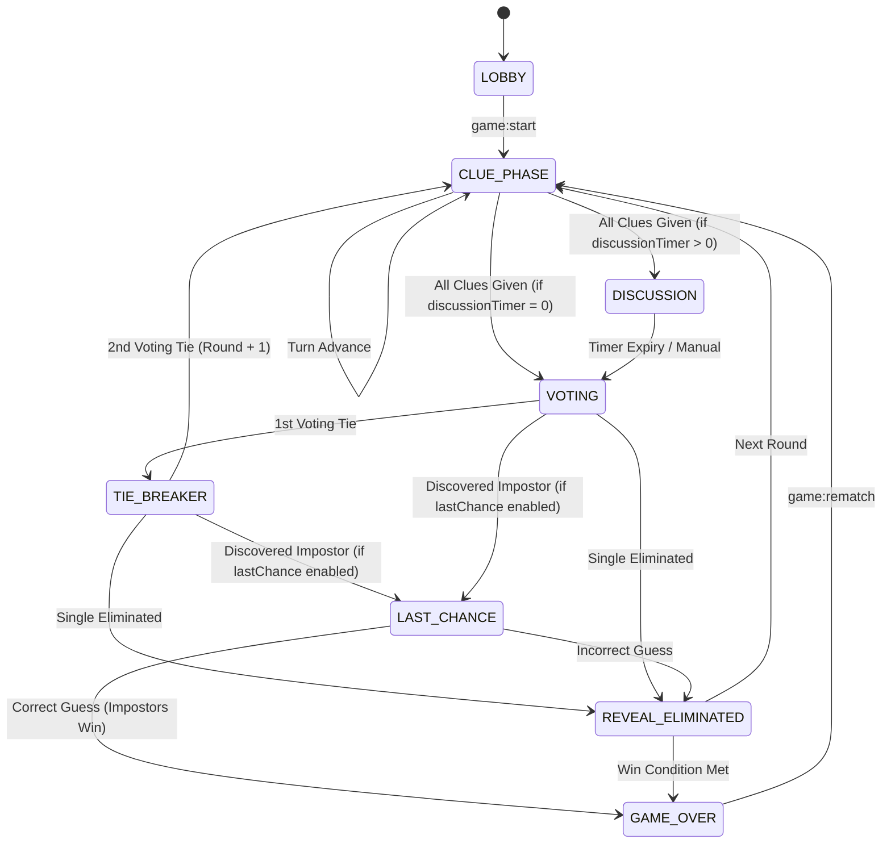

# Arquitectura del Sistema — Impostor

Este documento describe la arquitectura modular del juego en tiempo real **Impostor**.

---

## 1. Topología del Monorepo

```text
impostor/
├── apps/
│   ├── web/                     # Frontend SPA: React 18, Vite, Tailwind CSS, Socket.IO Client, Web Audio API
│   └── server/                  # Backend: Node.js, Express, Socket.IO, Helmet, CORS, In-Memory RoomStore
├── packages/
│   ├── shared/                  # Tipos TypeScript compartidos, esquemas Zod, DTOs y serializadores seguros
│   └── game-engine/             # Máquina de estados pura del juego, reglas, scoring y desempates
├── data/
│   └── words/                   # Datasets de categorías (Objetos, Comida, Fútbol, Películas, Series, Videojuegos)
├── scripts/
│   ├── validate-data.ts         # Script de validación rigurosa de calidad de datasets
│   └── generate-datasets.ts     # Generador de datasets de palabras
├── tests/                       # Suite de tests unitarios, de seguridad e integración
└── docs/                        # Documentación técnica
```

---

## 2. Flujo de Datos y Seguridad (Zero Data Leakage)

El servidor Node.js es la **única fuente de verdad**:

```text
               ┌───────────────────────────────┐
               │         Frontend React        │
               └──────────────┬────────────────┘
                              │
                    (Socket.IO / HTTPS)
                              │
                              ▼
               ┌───────────────────────────────┐
               │    Servidor Node.js + Express │
               ├───────────────────────────────┤
               │ • Session Verification        │
               │ • Rate Limiting Middleware    │
               │ • Room & Session Manager      │
               │ • Server-Side Authoritative   │
               │   Timers                      │
               └──────────────┬────────────────┘
                              │
                              ▼
               ┌───────────────────────────────┐
               │          GameEngine           │
               │ (Pure In-Memory State Machine)│
               └───────────────────────────────┘
```

### Serialización Segura (Anti-DevTools Cheating)
- `toPublicRoomState(room)`: Solo expone fase de juego, orden de turnos, cantidad de votos emitidos e historial de pistas. **Nunca incluye la palabra secreta ni la lista de impostores**.
- `toPlayerPrivateState(room, playerId)`:
  - **Inocente**: Recibe la palabra secreta y la categoría.
  - **Impostor**: Recibe su rol de impostor, la pista contextual (si está activada) y la lista de compañeros cómplices (si se conocen). **Nunca recibe la palabra secreta**.

---

## 3. Máquina de Estados del Juego



---

## 4. Despliegue en Producción

- **Frontend**: Despliegue en **Vercel** o similar estático (`npm run build -w @impostor/web`).
- **Backend**: Despliegue en servicio persistente Node.js con soporte WebSockets como **Railway**, **Render** o **Fly.io** (`npm start -w @impostor/server`).
